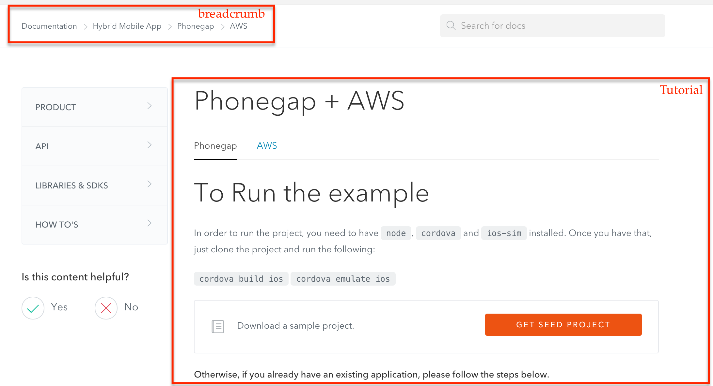

# Auth0 Navigator Tutorial


- [Usage](#usage)
- [Install & Build](#install-build)
	- [From Auth0's CDN, ready to go](#from-auth0s-cdn-ready-to-go)
	- [Downloading from this repository](#downloading-from-this-repository)
	- [Development](#development)
- [API](#api)
- [Component Structure](#component-structure)

> We included `react`, `react-dom` and `fluxible` libraries as peerDependencies in the package.json to avoid multiple instances of the libraries instantiated when installing the project with npm.

## Usage

### Using fluxible

The tutorial navigator widget was created to work with [yahoo/fluxible](https://github.com/yahoo/fluxible/) library. To use it you must create a fluxible app and register the `TutorialStore` and `ArticleStore` stores. Then, in the view, you can add the `TutorialNavigator`, `Breadcrumbs` and `Tutorial` react components to render the navigator.

First you'll need to install the tutorial navigator using NPM.

	npm install --save git@github.com:auth0/tutorial-navigator.git

After installing the tutorial navigator you create a fluxible app and register the two stores.

````
import Fluxible from 'fluxible';
import { TutorialStore, ArticleStore } from 'auth0-tutorial-navigator';
import serviceProxyPlugin from 'fluxible-plugin-service-proxy';

...

// create new fluxible instance
var app = new Fluxible({
    component: Application
});

// register plugins
app.plug(serviceProxyPlugin());

// register stores
app.registerStore(TutorialStore);
app.registerStore(ArticleStore);

...
````

_App.js - Creating a fluxible app and register the stores_

Register the `articleService` using `Constants.ArticleServiceName` to retrieve the selected tutorial.

````
...
import { Constants, articleService } from 'auth0-tutorial-navigator';

app.getPlugin('ServiceProxyPlugin').registerService(Constants.ArticleServiceName, articleService);

...
````

_Register the article service to retrieve the selected article from the API_


After registering the service, create the context and instantiate then execute the `loadSettingsAction` to set the initial settings of the Tutorial Navigator.

````
import { loadSettingsAction, Constants } from 'auth0-tutorial-navigator';

let context = app.createContext();
var actionContext = context.getActionContext();

actionContext.executeAction(loadSettingsAction, {
	quickstart: { QUCKSTART-OBJECT-PARAM },
	navigation: { NAVIGATION-PARAM }
})).then(() => {

	//// Create your fluxible application element

});

...
````

_Set the initial settings of the context after creating the context_

Inside your fluxible application views you instantiate the `TutorialNavigator`, `Breadcrumbs` and `Tutorial` react components. You can also set other custom properties (_e.g. customNavigationAction and componentLoadedInBrowser_ ) depending on your needs.

````
...
<TutorialNavigator customNavigationAction={CUSTOM-NAV-PARAM} componentLoadedInBrowser={COMPONENT-LOADED}/>
...
````

_Tutorial Navigator instance in the app_


### Without fluxible

If you don't have fluxible in your context, you will need to create the context by your own before instantiating the component.

Include a script reference to the standalone version of the tutorial navigator

````
<script type="text/javascript" src="[TODO-REPLACE]"></script>
````

Use the provided function to create a custom context

````
...
var createCustomContext = require('tutorial-navigator').createCustomContext;
var context = createCustomContext();
...
````

Call `loadSettingsAction` with the custom context and the initial settings. The function returns a promise.

````
loadSettingsAction(context, {
	baseUrl: { BASE-URL-PARAM },
	quickstart: { QUCKSTART-OBJECT-PARAM },
	navigation: { NAVIGATION-PARAM }
})
````

Once the initial loading completes, you can call React.render with the `NavigatorAndTutorialView` passing the context as the custom options (which already has the TutorialNavigator and TutorialView inside it)

var NavigatorAndTutorialView = tutorialNavigatorPackage.NavigatorAndTutorialView;

````
...

React.render(
	React.createElement(NavigatorAndTutorialView, {
		context : context,
		tutorialLoadedInBrowser : function(){
			...
		}
	}),
	$('#tutorial-navigator').get(0)
);
````

## Install & Build

### From Auth0's CDN, ready to go

```html
<link rel="stylesheet" type="text/css" href="https://cdn.auth0.com/tutorial-navigator/0.7.2/build.css">
<script type="text/javascript" src="https://cdn.auth0.com/tutorial-navigator/0.7.2/build.js"></script>
```

> You may also use our minified or standalone versions `build.min.*`.

### Downloading from this repository

Run the following lines in your terminal

```bash
$ git clone git@github.com:auth0/tutorial-navigator.git
$ cd tutorial-navigator
$ npm build
```

And then you can get the files from the `build/` folder.

### Development

```bash
$ git clone git@github.com:auth0/tutorial-navigator.git
$ cd tutorial-navigator
$ npm start
```

After that you will have access to [http://localhost:8989/](http://localhost:8989)

## API

This are the list of properties you use to initialize the contorl

|Name             |Type     |Description|Required|
|:---:|:---:|---|---|
|`docsDomain`       |string   | base url used to fetch the tutorial||
|`basePath`         |string   |||
|`selectedTutorial` |object   | if set, it will try to load the tutorial ||
|`routing`          |bool     | if enabled it will use page for routing||
|`userTenants`      |array    |||
|`platforms`        |object   | object containing all the information required by the control||
|`platformsFetchFn` |function | if platforms is not defined, it will use this function to get the platforms from the server. Should return a promise||
|`singleTpl`        |element  | Element used for parsing the tutorial||
|`onTutorialLoad`   |function | Event triggered when the tutorial is loaded||
|`onTutorialReset`  |function | Event triggered when the tutorial is reset||
|`onTutorialUpdate` |function | Event triggered on navigation| |

## Component Structure

The TutorialNavigator react class contains all the elements and is in charge of mantaining the state.

The grid below the title is the list of Quickstarts  

  

  _Tutorial Navigator and Quickstart list_

When you click on one Quickstart the list is loaded with a list of techonologies

  

  _Tech list_

Once you click on the Techonology the template is requested and loaded in the defined template

  

  _Tutorial Loaded_

## Issue Reporting

If you have found a bug or if you have a feature request, please report them at this repository issues section. Please do not report security vulnerabilities on the public GitHub issue tracker. The [Responsible Disclosure Program](https://auth0.com/whitehat) details the procedure for disclosing security issues.

## Author

[Auth0](auth0.com)

## License

This project is licensed under the MIT license. See the [LICENSE](LICENSE) file for more info.
